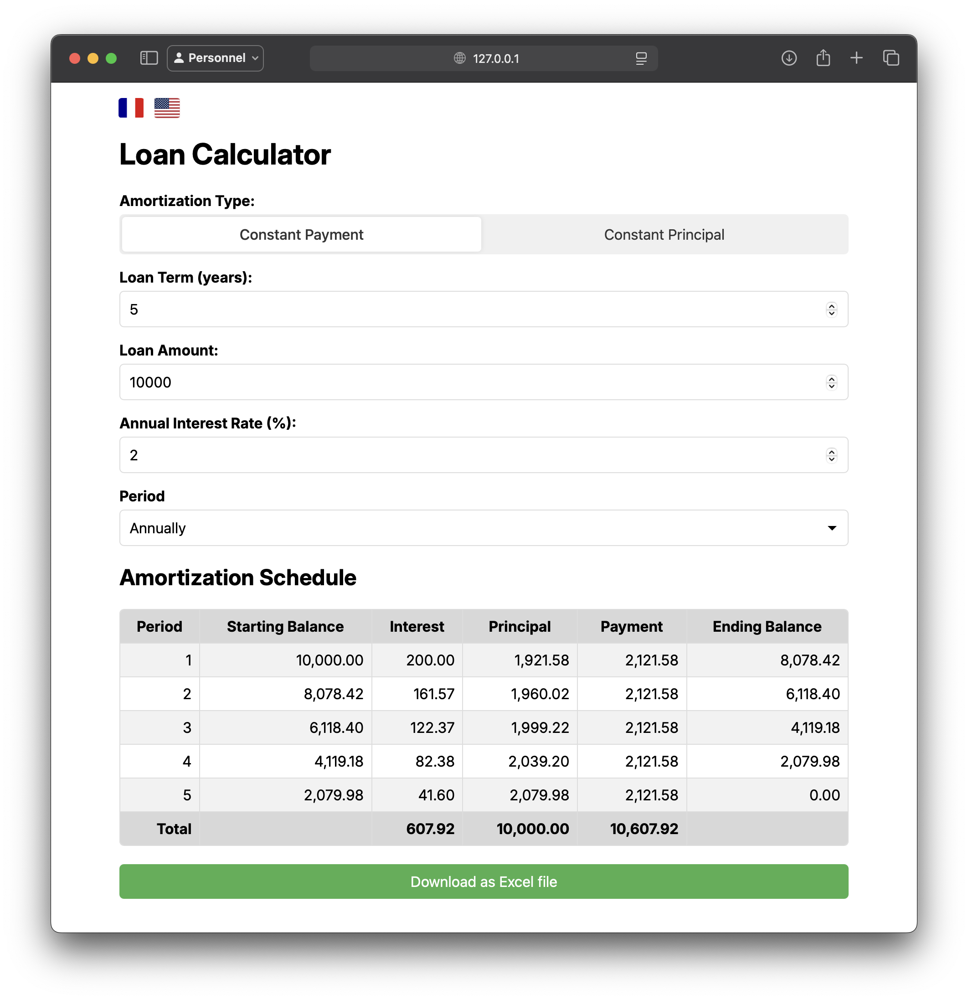

# Pyloans

A simple loan calculator web app made using Flask.

## Contents

* [🚀 Introduction](#-introduction)
* [🛠️ Installation](#️-installation)
* [🏞️ Screenshots](#️-screenshots)


## 🚀 Introduction

This project was made during one of my finance classes during which we had to calculate loans line by line. This automates the process while dynamically updating the result on small web app made using Flask. You can also download the result as an Excel file if you need it.


## 🛠️ Installation

### Requirements

To install the project, make sure you have `python` installed on your machine. If it's not, download it from [python.org](https://www.python.org) or get it from your package manager.

### Step-by-step setup

1. **Cloner the repository**:
    ```sh
    git clone http://github.com/malcolm-a/pyloans
    ```
2. **Go into the directory**:
    ```sh
    cd pyloans
    ```

3. **(Optional) Create a virtual environment**
    ```sh
    python3 -m venv venv
    source venv/bin/activate
    ```
4. **Install dependencies**:
    ```sh
    pip install -r requirements.txt
    ```
5. **Start the server**:
    ```sh
    flask run
    ```

## 🏞️ Screenshots


